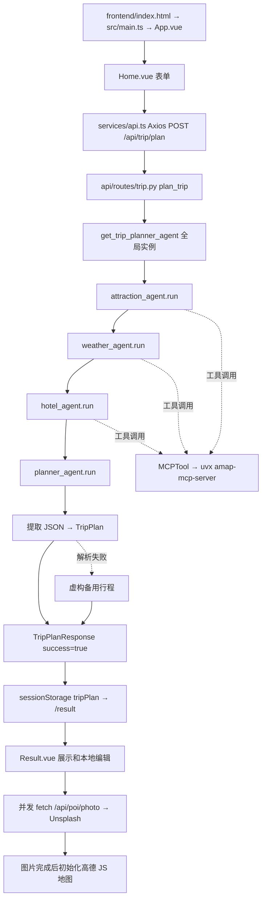

# Phase 0：现有架构分析

> 本文件是 Phase 0 历史快照。Phase 1 已修复部分问题，当前状态请看 [progress.md](progress.md) 和 [phase1.md](phase1.md)。

分析日期：2026-09-09。事实来源为当前源码、AGENTS.md、根目录 `docs-project_spec.md` 和本文记录的离线验证。用户指定的 `docs/project_spec.md` 不存在，采用内容相符的根目录规格文件；未移动或改写规格。

## 1. 仓库与运行基线

- 当前目录：`E:\travel-agents-1\helloagents-trip-planner`。
- `git status --short` 和 `git rev-parse --show-toplevel` 均返回 `fatal: not a git repository`。无法确认分支、提交、远程或已有修改，不能称为“工作区干净”；本阶段不初始化 Git。
- 存在 backend、frontend、README、AGENTS 和根目录规格；未发现现有测试、LangGraph 工作流、Redis/MySQL、RAG、Docker 或 CI 实现。
- 前端有 package-lock.json；后端 requirements.txt 使用版本范围，没有锁定整个环境。README 的能力描述不能代替实现证据，尤其是路线规划。
- 示例环境文件包含疑似真实凭据（后端 LLM、地图、Unsplash；前端地图配置）。不在文档复制值、不验证有效性。若为真实凭据，应由持有人撤销/轮换，后续将示例改为占位符。

## 2. 入口与完整请求链路

### 前端

1. `frontend/index.html` 加载 `src/main.ts`；后者注册 Vue Router（`/`、`/result`）和 Ant Design Vue，挂载 App.vue。
2. `Home.vue` 用 Dayjs 日期差计算包含首尾的天数（1–30），构造 TripFormData。额外要求保留为字符串，未提取结构化约束。500ms 定时器模拟进度，不是后端执行状态。
3. `services/api.ts` 使用 `VITE_API_BASE_URL`，默认 `http://localhost:8000`；Axios 超时 120 秒。默认绝对地址绕过 Vite 的 `/api` 代理。
4. 成功结果写入 sessionStorage 的单个 `tripPlan` 键，跳转 Result.vue。无服务端计划 ID、历史计划查询或任务恢复协议。
5. Result.vue onMounted 直接 JSON.parse 存储结果，没有运行时 schema 校验或损坏数据恢复。图片请求已经通过 Promise.all 并发，但没有限流、去重、超时或取消；URL 硬编码 localhost，绕开统一 API 客户端。
6. 每张图片经 `GET /api/poi/photo?name=...` 调用 Unsplash：先查“名称 China landmark”，无结果再查名称。后端 requests.get 同步调用，单次 timeout=10，无显式 retry。
7. 全部图片请求结束后才 initMap。地图直接使用 `VITE_AMAP_WEB_JS_KEY`；源码未使用示例中的 `VITE_AMAP_SECURITY_JS_CODE`。地图按每天坐标画 Polyline，仅是景点连线，不是步行/驾车/公交导航，也无交通耗时。
8. 删除、调序、编辑只改前端计划；saveChanges 写回 sessionStorage 并重建地图，不请求后端校验或预算重算。图片/PDF 导出基于 html2canvas/jsPDF，可复用展示思路，但有重复导出代码。地图 InfoWindow 直接拼接名称/地址/描述为 HTML，需后续处理不可信文本。

### 后端

1. 在 backend 下运行 `python run.py`，或 `uvicorn app.api.main:app`。run.py 使用配置启动 Uvicorn，reload=True。
2. `app/api/main.py` 创建 FastAPI、注册 CORS，将 trip、poi、map 路由挂到 `/api`；startup 验证配置，shutdown 仅打印消息。
3. `POST /api/trip/plan` 经 Pydantic TripRequest 校验后，在 async 路由中直接同步执行 `agent.plan_trip(request)`，阻塞事件循环。
4. `MultiAgentTripPlanner.plan_trip` 串行调用四个 SimpleAgent。景点搜索只使用第一个 preference；天气仅传城市；酒店仅传城市和住宿偏好，没有使用景点检索结果。Planner 接收三段自然语言结果及原始额外要求。
5. `_parse_response` 用代码围栏或首尾大括号截取 JSON，json.loads 后构造 TripPlan。没有结构化输出协议、来源绑定、硬约束校验或 Replan。
6. 解析失败或规划执行异常返回 `_create_fallback_plan`：任意城市都使用北京附近坐标、虚构景点名称，天气为空、预算缺失；路由仍返回 success=True。非法日期还可能使 fallback 再次抛错，最终 500。

### 旁路 API（未接入主规划工作流）

| 接口 | 实际处理 | 当前结果/限制 |
| --- | --- | --- |
| GET /api/map/poi | AmapService.search_poi | 调工具后仍返回 []，解析 TODO；异常也 [] |
| GET /api/poi/search | 同上 | 重复入口，返回裸 dict 包装 |
| GET /api/map/weather | AmapService.get_weather | 解析 TODO，返回 []，仍可 success=True |
| POST /api/map/route | AmapService.plan_route | 解析 TODO，返回 {}；RouteInfo 必填字段缺失，响应构造触发异常→500 |
| GET /api/poi/detail/{poi_id} | get_poi_detail | 贪婪正则抽 JSON，失败返回 {}，或返回 raw 字符串包装；无明确详情类型 |
| GET /api/poi/photo | UnsplashService | 两级查询；空图/上游异常可作为成功返回 null |
| GET /health、/ | 静态状态 | 不代表外部依赖可用 |
| GET /api/trip/health | 创建 planner 后读 agent.agent | MultiAgentTripPlanner 无 agent 属性，初始化成功也会 503 |
| GET /api/map/health | 创建服务，读 _available_tools | 访问 SDK 私有字段，不能证明实际工具可调用 |

`AmapService.geocode` 同样是解析 TODO，返回 None；目前没有对应路由或主链路调用。

## 3. 关键代码定位与职责

| 概念 | 位置 | 实际职责 |
| --- | --- | --- |
| Agent | backend/app/agents/trip_planner_agent.py | MultiAgentTripPlanner 初始化并持有四个 SimpleAgent |
| Prompt | 同文件四个 *_AGENT_PROMPT、两个 _build_*_query | 固定工具指令、JSON 输出样例、检索结果和用户需求拼接 |
| LLM | backend/app/services/llm_service.py:get_llm | 全局 HelloAgentsLLM()；Settings 未显式传入构造器 |
| 配置 | backend/app/config.py | load_dotenv、邻近 HelloAgents/.env 回退、全局 Settings；LLM_* 与 OPENAI_* 两套来源 |
| MCP（主链） | MultiAgentTripPlanner.__init__ | 一个 MCPTool 分给三个检索 Agent；uvx 启动 amap-mcp-server |
| MCP（旁路） | services/amap_service.py:get_amap_mcp_tool | 另一个全局 MCPTool，结构化 action/tool_name/arguments 调用 |
| Pydantic | models/schemas.py | TripRequest、TripPlan、DayPlan、Attraction、Hotel、Meal、WeatherInfo、Budget、地图请求响应和 ErrorResponse |
| 例外模型 | api/routes/poi.py:POIDetailResponse | data 为 Optional[dict]，未统一到 schemas |
| 前端契约 | frontend/src/types/index.ts | 独立维护 TypeScript 类型；未包含后端 Attraction 的 poi_id/photos 等字段 |

## 4. 应改为 Service 的 Agent 与不必要的 LLM

- **天气 Agent → WeatherService**：城市已知，工具和参数固定，查询与解析无需模型。预报只应覆盖工具实际返回日期；当前 Prompt 强制“每天天气”，超过预报范围时可能诱导编造。
- **酒店 Agent → HotelService**：当前只做城市+住宿关键词搜索，没有独立决策。搜索、距离过滤、排序由代码负责；复杂偏好解释可以留给约束提取或 Planner。
- **景点 Agent → POIService**：现有代码已经构造工具调用文本，仍让 LLM 再输出调用并总结。固定偏好可直接映射关键词；真正复杂的语义检索需求才用约束提取生成搜索意图。
- **Planner 保留 LLM**：从候选中安排活动与解释偏好有意义；不让模型负责加法、距离、时间或最终合法性。不是新增更多 Agent 的理由。

主流程是四次 Agent.run，不等于四次 LLM 请求。本机已安装 hello-agents 0.2.9，其 `agents/simple_agent.py:run` 在工具调用后再次 invoke，总工具迭代默认最多三轮，达到上限可再生成最终回答。实际请求数/Token 未测量，不能报告性能收益。

## 5. 并发机会与边界

| 工作 | 可并发范围 | 依赖和约束 |
| --- | --- | --- |
| 当前景点、天气、酒店检索 | 三者只依赖输入，可同时运行 | 先隔离 Agent 历史、统一 MCP 生命周期；不能直接并发共享有状态 Agent |
| 多个偏好关键词、POI 详情 | 独立查询可有界并发 | 先有关键词/POI ID；按城市+ID 去重、限流 |
| 未来路线矩阵 | 坐标已知后独立路段并发 | 最终排序依赖矩阵，不能提前规划真实路线 |
| 图片和地图初始化 | 两者独立 | 前端图片本已并发；地图不必等待所有图片 |
| 单图片二次搜索 | 不宜无条件并发 | 第二次只在首查无结果时需要 |

采用异步客户端、每工具 timeout、总 deadline、可重试错误的有界退避、并发上限和类型化 partial failure。同步 SDK 若只能放线程，需记录超时不等于线程/远端调用取消，并验证 MCP 会话并发安全。以上是后续设计，不是当前已有能力。

## 6. 主要问题

### 状态

全局 planner/LLM/MCP/Service 缺少显式生命周期和请求隔离。已阅读本机 hello-agents 0.2.9 的 SimpleAgent.run：会读取 `_history`，并把请求和回答写回历史；项目没有清理或按用户隔离，后续请求会携带之前的对话。改异步并发前尤其要处理该问题。多 worker 还会各自创建全局实例，无统一持久化、checkpoint、request_id 或恢复状态。reset_llm 仅清空模块变量，不替换已创建 Agent 内的引用。

### 异常与配置

- 大量 catch Exception 后返回空值/虚构计划，无法区分正常无结果、解析错误、超时和上游失败；ErrorResponse 定义但未统一使用，HTTPException detail 直接暴露原始异常文本。
- 主规划与地图 async 路由运行同步 I/O；项目层没有统一 timeout/retry/cancel。不能据此断言 SDK 内部没有重试。前端 120 秒与示例 LLM_TIMEOUT=180 秒不匹配，端到端截止时间没有协调。
- print/traceback 缺少结构化日志、请求关联和脱敏策略；log_level 配置并不统一管理这些输出。
- 配置在 import 时加载，依赖工作目录与邻近项目 .env；LLM 缺密钥仅警告，地图缺密钥使 startup 失败。健康检查语义混乱。
- Unsplash 使用 requests，但 requirements.txt 未直接声明 requests；前端直接 import dayjs、@ant-design/icons-vue，package.json 未直接声明，依赖传递安装不稳。

### 模型、预算与约束

- 日期是 str，未检查格式、先后或 travel_days 一致；坐标无范围，费用/时长无非负约束，交通/餐饮类型未用后端枚举。Pydantic 存在不代表业务有效。
- 无 budget_limit、人数、币种、住宿夜数、must_visit/avoid、步行/交通上限等结构化输入；free_text_input 只拼入 Prompt。
- Budget 完全接受 LLM 汇总，不重算项目费用，交通缺明细，缺失费用默认为 0 混淆未知与免费。前端删景点后汇总不更新。
- 景点可不带真实 poi_id，坐标与候选不绑定；缺开放时间、预约、到离开时刻、实际路线，无法验证硬约束。
- 温度解析失败强制变 0，伪造了看似可信的观测值。WeatherInfo 类型仍允许字符串，前端期望 number。

### Tool Calling

主链 Prompt 使用 `[TOOL_CALL:amap_maps_text_search:...]` 文本语法，旁路用 `maps_text_search` 结构化参数；需要测试展开名称与服务端 schema 的映射，不能仅凭名称不同认定不兼容。缺少项目级参数验证、工具白名单收敛、来源元数据和统一错误协议。三个 Agent 均获得整个展开工具集；没有针对职责限制能力。两套 MCP 构造重复，shutdown 未清理资源。旁路返回解析多数未完成，不能直接替代主链而宣称完成检索迁移。

## 7. 可复用内容

- 保留 FastAPI 入口、路由分组及现有 `/api/trip/plan` 兼容边界，逐步替换内部实现。
- 扩展现有 Pydantic/TypeScript 模型；保留字段迁移适配，不从零设计另一套无关接口。
- AmapService 的工具映射、参数构造和 get_* 依赖入口可复用；返回解析与错误语义必须补齐。
- Planner 的输入组织及行程展示字段可复用；移除其中确定性计算责任，替换脆弱解析和虚构兜底。
- 前端表单、日期联动、日程/天气/预算组件、地图标记及导出思路可渐进改造。
- Unsplash 封装与占位展示可保留为可选增强，图片失败不应阻断计划。

## 8. 实际验证（无外部请求）

环境：Python 3.10.1、Node 24.15.0；已安装 pydantic 2.13.4、fastapi 0.141.1、hello-agents 0.2.9。

1. Python ast.parse 检查 backend 全部 17 个 .py：通过。这是语法验证，不是应用启动验证。
2. 直接执行 schemas.py 并断言：反向日期、非法坐标、负数/不一致预算均被接受；无法解析温度变 0。全部复现。
3. AST 提取原始 MultiAgentTripPlanner 类，跳过构造器，调用 `_parse_response('not json', request)`：上海请求返回 116.4 经度的虚构景点，并可包装 success=True。未初始化 LLM/MCP。
4. AST 提取 trip.health_check，注入上述 planner 对象：复现访问缺失 agent 属性后返回 503。
5. `npm --prefix frontend run build`：失败，`vue-tsc` 不可用。未安装依赖，因此不能判断前端类型检查和打包能否通过。

这些是现状探针，不是修复后的通过测试。未启动完整应用、未调用真实 LLM/MCP/Unsplash、未验证浏览器交互，未测延迟、成本或成功率。
